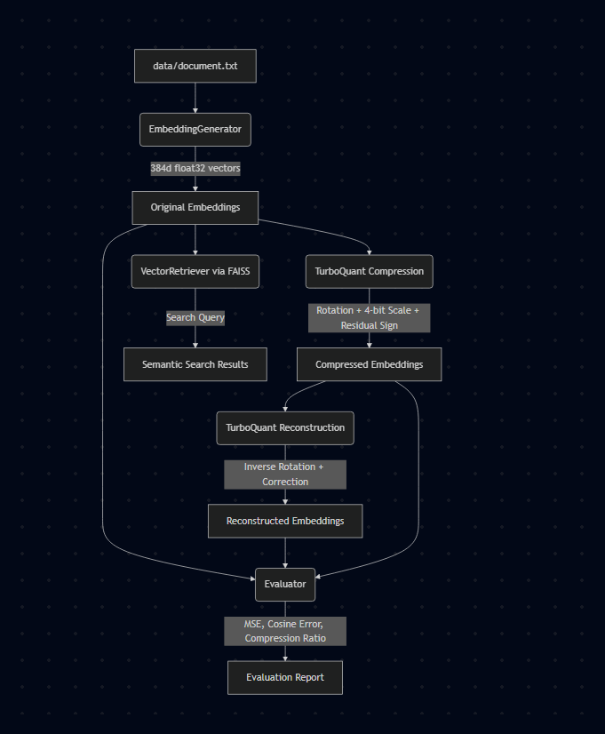

# TurboQuant Embedding Compression and Retrieval Pipeline

This project demonstrates how to generate vector embeddings for text documents and apply the **TurboQuant** compression algorithm to reduce the storage footprint of these embeddings while maintaining high search accuracy in RAG (Retrieval-Augmented Generation) systems.

## Project Flowchart

---

## 1. Complete Workflow

The project executes in five major stages:

1. **Embedding Generation**:
   Raw sentences are loaded from [data/document.txt](data/document.txt). These sentences are converted into high-dimensional vector embeddings using a pre-trained Sentence Transformer model (`all-MiniLM-L6-v2`).
2. **Original Indexing & Search**:
   The original, high-precision embeddings are normalized and loaded into a FAISS index to run a baseline semantic search. We retrieve the top-3 most similar sentences to a query (e.g., _"What is vector search?"_).
3. **TurboQuant Compression**:
   The embeddings are rotated orthogonally to balance their dimensional variance, quantized into a 4-bit signed integer format, and a 1-bit residual sign correction is extracted. The final compressed components are saved to [embeddings/compressed_embeddings.npz](embeddings/compressed_embeddings.npz).
4. **Embedding Reconstruction**:
   The 4-bit quantized embeddings are dequantized back into floats, adjusted using the residual sign bits to recover loss, and inversely rotated back to the original vector space.
5. **Reconstructed Indexing & Comparative Search**:
   A second FAISS index is built using the reconstructed embeddings. The same semantic search query is executed, and the results are compared side-by-side with the original baseline to verify rank preservation and accuracy.

---

## 2. File Significance & Roles

- **[main.py](main.py)**: The main orchestrator script that loads data, calls the encoder, runs the baseline search, triggers TurboQuant compression and reconstruction, runs the comparative search, prints reports, and saves outputs.
- **[embeddings.py](embeddings.py)**: Contains the `EmbeddingGenerator` class which leverages `sentence-transformers` to encode text sentences into `float32` vector arrays.
- **[turboquant.py](turboquant.py)**: Implements the core `TurboQuant` algorithm, handling orthogonal rotations, 4-bit scaling quantization, residual extraction/correction, and reconstruction.
- **[retrieval.py](retrieval.py)**: Contains the `VectorRetriever` class which builds a FAISS `IndexFlatIP` (flat Inner Product) index and performs cosine similarity search.
- **[evaluate.py](evaluate.py)**: Contains the `Evaluator` class to calculate MSE, cosine similarity differences, and compression ratios.
- **[data/document.txt](data/document.txt)**: The text dataset representing the document store to be indexed.
- **[evaluation_report.txt](evaluation_report.txt)**: The generated report containing baseline search results, reconstructed search results, comparison tables, and execution metrics.

---

## 3. Evaluation Metrics Explained

- **Mean Squared Error (MSE)**: Measures the average squared difference between the original and reconstructed embedding coordinates. A very low MSE (e.g., `0.000060`) indicates that the reconstruction matches the original data with minimal distortion.
- **Cosine Error**: Calculates the average absolute shift in cosine similarity across all pairs of vectors before and after compression. A small error (e.g., `0.01` or 1%) ensures the relative angular relationships are preserved, which is crucial for search accuracy.
- **Compression Ratio**: Compares the memory footprint of the original 32-bit floats (`float32` = 4 bytes) with the compressed 4-bit values (stored as `int8` = 1 byte). A `4.00x` compression ratio means the database occupies only **25%** of its original size.
